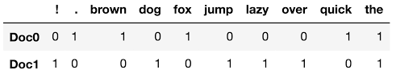
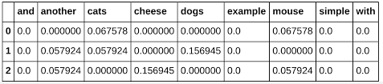

# Sentiment_analysis_ML

Sentiment analysis is one of the populat NLP projects amoung begineers. The goal is to predict which text contains the negative or positive sentiment.  
 
Machine learning algorithms are used when we have numbers or classes in dataset and using them we have to predict. But when dataset contains the raw text (comments, reviews, articles, title of article etc) we need the power of Natural Language processing to convert that raw text into some number representations.  
 
There are 2 ways to create a matrix representation of text corpus( list of text):  
<t> 1) Count Vectorizer: Each cell represents the number of times a word appeared in that row (i.e. document)  
    2) Tf-Idf Vectorizer: Each cell represnets a tf-idf number: (# of times word appear in that document/ log(total documents/total documents that contain that word)) </t>
 
Below images represent the 2 matrix types :

## 1. Count Vecorizer Matrix 
  

 
## 2. TF_IDF Vectorizer Matrix 
  

Below mentioned are the steps that I followed for this problem:  
a.) Load Amazon reviews Data  
b.) Read lines and decode using utf-8  
c.) Clean text by removing punctuations and stop words, lemmatizing them and also seperating labels  
d.) Once all 3.6 million reviews are cleaned, store them in a DataFrame for easy data manipulation  
e.) Taking only first 50,000 data rows (as the program was ran on CPU, so low computation power)  
f.) Split data into train and test  
g.) Create a TFIDF matrix (again to overcome computation problem, I am using max_features=6000 and only considering uni-grams) 
h.) Create a Random Forest Classifier Model with 100 tress and max depth of tree to 100.  
i.) Create a Gaussian Naive Bayes Classifier model and fit both models using tf-idf matrix  
j.) Compare the results.  

<b>NOTE:<b/>  
For this project, I have used publicaly available dataset from Kaggle to learn Machine Learning, Deep Learning and NLP methodologies for personal growth.

